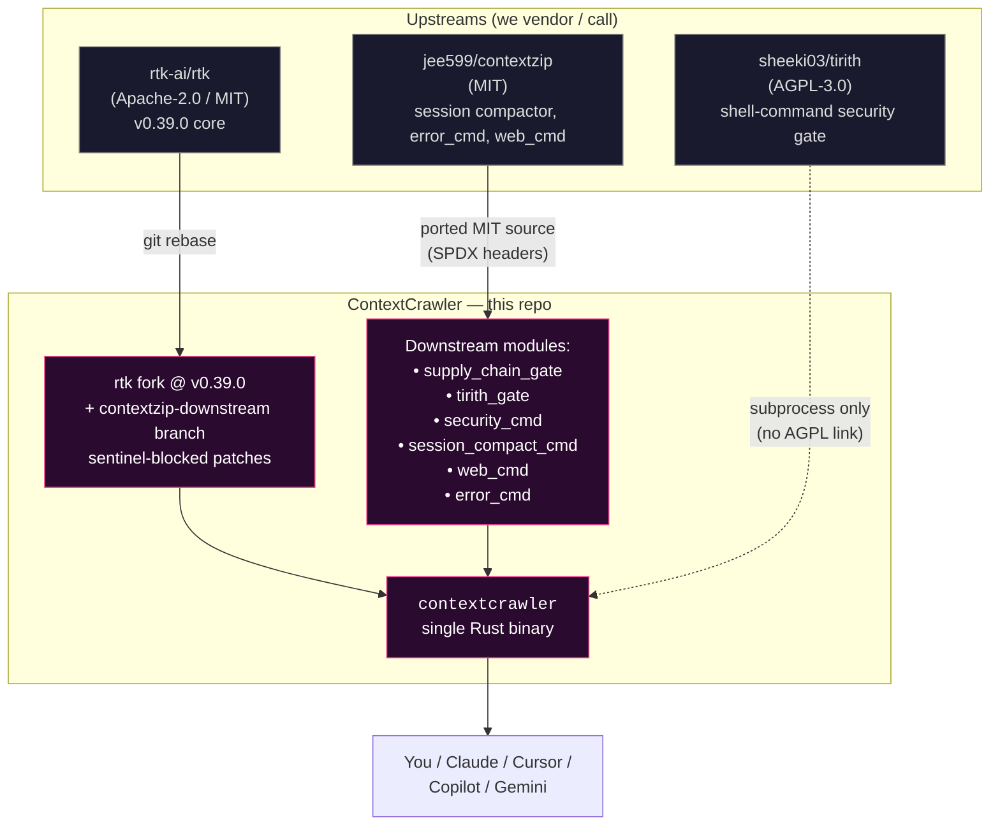
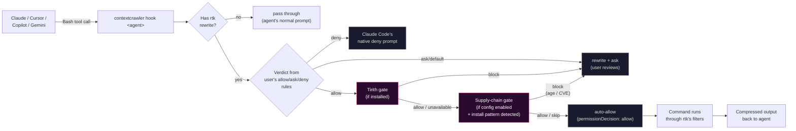
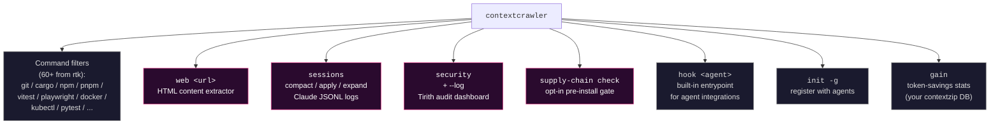

<p align="center">
  
</p>

# ContextCrawler

> [!WARNING]
> **Active development. Might work, might not. Use at your own risk.**
>
> This is a fast-moving downstream fork by one person. Before depending on
> it: build it yourself, test it against your own workflow, read the diff
> on top of upstream rtk, and run the code through your favourite LLM for
> a second opinion (why not). **Don't trust me — verify.** Bug reports
> welcome; expectations of stability shouldn't be.

A downstream distribution of [rtk-ai/rtk](https://github.com/rtk-ai/rtk)
that brings the [jee599/contextzip](https://github.com/jee599/contextzip)
feature set forward to current rtk and stitches in
[Tirith](https://tirith.sh) for defense-in-depth on the auto-allow path.

One binary, one name: **`contextcrawler`**. If you've been using `contextzip`
and want to stay on a current rtk base without losing the contextzip extras,
this is for you.

## How it's put together



## What happens when an agent proposes a command



## Feature surface



Pink-bordered boxes are ContextCrawler-specific additions; grey-bordered ones inherit from upstream rtk.

## What you get

A single `contextcrawler` binary with these capabilities:

| Surface | Purpose |
|---|---|
| `contextcrawler` (root) | Drop-in for everyday rtk-style filtering: `contextcrawler git status`, `contextcrawler cargo test`, etc. Same 60+ command filters rtk ships. |
| `contextcrawler web <url>` | Fetch a URL with curl, strip nav/ads/scripts via `scraper`. ~86% byte savings on typical pages. |
| `contextcrawler sessions compact <id>` | Compact Claude Code session JSONL — dedupes repeated file-reads, recompresses past Bash outputs. Sidecar-based; never touches the original. |
| `contextcrawler sessions apply <id>` / `expand <id>` | Promote a sidecar to live / roll back. |
| `contextcrawler security` | Tirith integration dashboard — audit stats, gate mode, detection-rule breakdown. |
| `contextcrawler security --log` | Tail the local gate-downgrade log. |
| `contextcrawler hook claude/cursor/copilot/gemini` | Built-in agent hook entrypoints (set in agent settings via `contextcrawler init`). |
| Stacktrace compressor | Wired into the runner pipeline. Detects framework frames in Node / Python / Rust / Go / Java tracebacks and drops them. |
| Tirith pre-execution gate | Optional. When `tirith` is installed, every auto-allow rewrite is first run past `tirith check`. Block-level findings downgrade to *Ask* so you review the command. Fail-open by default. |

## Install

```sh
git clone https://github.com/thehoff/contextcrawler.git contextzip
cd contextzip
cargo build --release --manifest-path rtk-fork/Cargo.toml
cp rtk-fork/target/release/contextcrawler ~/.local/bin/contextcrawler

# Hook into Claude Code (and other agents — see `contextcrawler init --help`)
contextcrawler init -g

# Optional: defense-in-depth gate
cargo install tirith
eval "$(tirith init --shell zsh)"   # or bash / fish
```

Migrating from jee599/contextzip? See [`MIGRATING_FROM_CONTEXTZIP.md`](MIGRATING_FROM_CONTEXTZIP.md).

## Layout

```
contextZip/
├── rtk-fork/             # git clone of rtk-ai/rtk on branch contextzip-downstream
│                         #   atop v0.39.0. Carries small downstream patches.
├── notes/                # design notes + decision logs
├── CHANGELOG.md
├── MIGRATING_FROM_CONTEXTZIP.md
└── README.md             # this file
```

The rtk-fork uses a plain rebase model — every downstream commit lands
inside `// ===== contextzip-downstream =====` sentinel-block pairs in
`main.rs`, `runner.rs`, `rewrite_cmd.rs`, `hook_cmd.rs`, and a few hook
scripts, so upstream rebases stay confined to predictable lines.

## Track upstream

```sh
cd rtk-fork
git fetch origin
git rebase v0.40.0 contextzip-downstream   # resolve any sentinel conflicts
cargo build --release && cargo test --release
```

`git rerere` is enabled to auto-replay repeated conflict resolutions
across rebases.

## Defense-in-depth gate (optional Tirith pairing)

| | ContextCrawler | Tirith |
|---|---|---|
| Purpose | Shrink command output | Inspect commands |
| When | Post-execution filter | Pre-execution gate |
| Latency | ms–seconds | < 2 ms |

The gate calls `tirith check --format json` on any rewrite that would
auto-approve. When Tirith returns `action="block"`, the verdict is
downgraded to *Ask* so the user reviews the original command. The gate is
subprocess-only — no statically linked AGPL code.

```sh
contextcrawler security                  # human format
contextcrawler security --format json    # parseable
contextcrawler security --log            # tail recent gate downgrades
```

**Env knobs:**

| Variable | Effect |
|---|---|
| (default) | fail-open: if Tirith isn't installed, no gate, original rtk verdict stands |
| `CONTEXTZIP_TIRITH_REQUIRED=1` | fail-closed: refuse auto-allow without a working Tirith verdict |
| `CONTEXTZIP_TIRITH_DISABLED=1` | bypass the gate entirely (debug only) |

## License

The downstream parts of this repository are MIT.

- Upstream rtk-fork content remains under its original license terms (see
  `rtk-fork/LICENSE`). Note that upstream rtk's repo is internally
  inconsistent (`LICENSE` says Apache-2.0; `Cargo.toml` says MIT). We
  preserve those upstream files as-is.
- Source files we add or carry over carry per-file SPDX-License-Identifier
  headers citing their origin (jee599/contextzip MIT for ported modules;
  ContextCrawler contributors MIT for new additions).
- Tirith is AGPL-3.0 and is **only invoked via subprocess**; no statically
  linked AGPL code in this distribution.

## Attribution

- [rtk-ai/rtk](https://github.com/rtk-ai/rtk) — upstream base. Active,
  47K stars, current release v0.39.0. ContextCrawler tracks their tagged
  releases.
- [jee599/contextzip](https://github.com/jee599/contextzip) — source of the
  session compactor, stacktrace compressor, and HTML extractor. Each
  carried-over file has a per-file SPDX header citing this upstream.
- [sheeki03/tirith](https://github.com/sheeki03/tirith) — invoked via
  subprocess for the optional defense-in-depth gate.

## Status

v0.1.0 — first community release. See [`CHANGELOG.md`](CHANGELOG.md).
